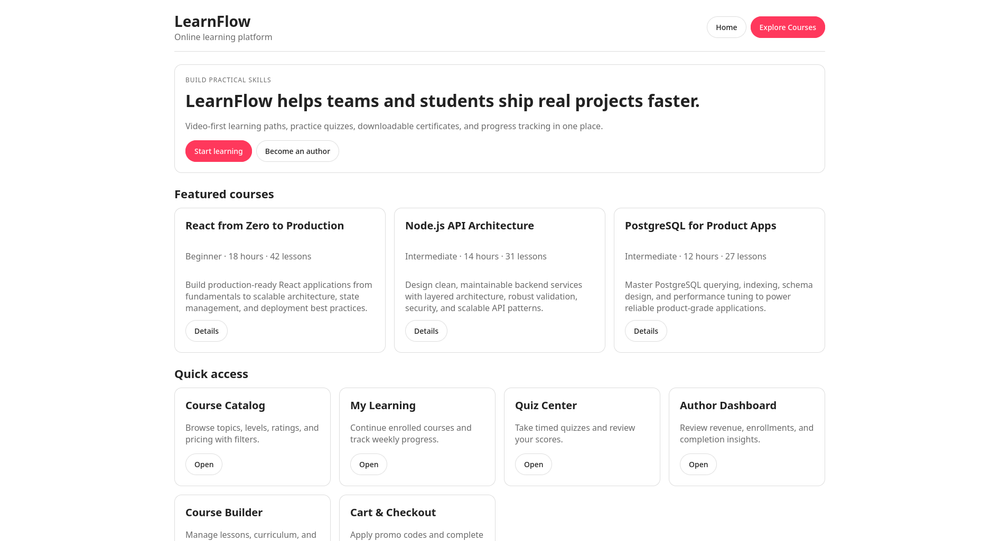
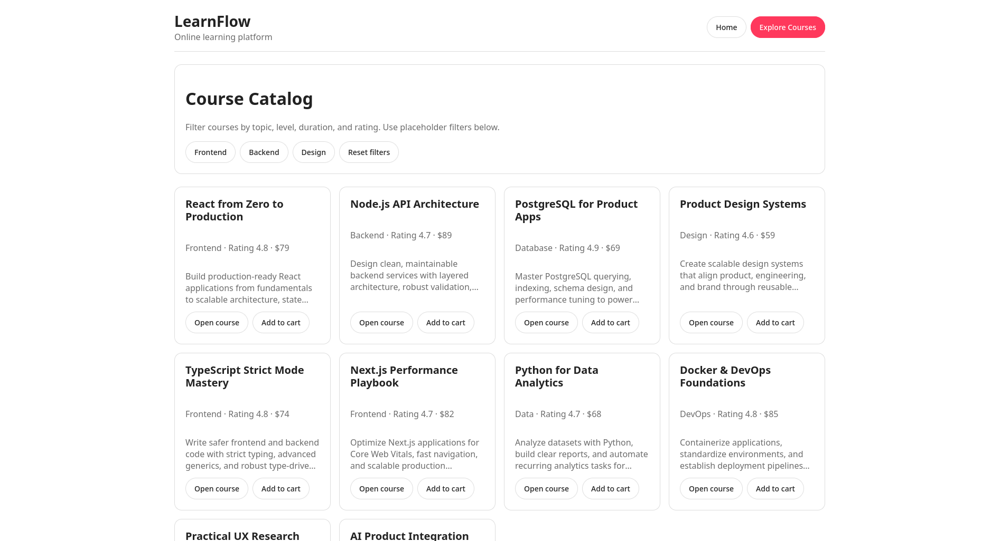
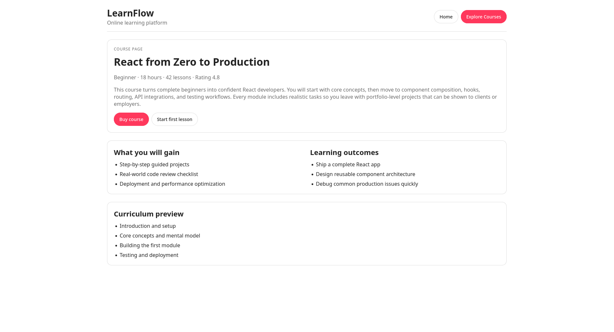

# LearnFlow

LearnFlow is an EdTech platform MVP for online learning with video lessons, quizzes, certificates, progress tracking, and an author workspace.

---

## Table of Contents

- [About](#about)
- [Core Features](#core-features)
- [Tech Stack](#tech-stack)
- [Monorepo Structure](#monorepo-structure)
- [Screenshots](#screenshots)
- [Getting Started](#getting-started)
- [Available Scripts](#available-scripts)
- [Development Notes](#development-notes)
- [Roadmap](#roadmap)

---

## About

This repository contains a monorepo scaffold of LearnFlow with:

- **`apps/web`** — Next.js App Router frontend
- **`apps/api`** — TypeScript API skeleton
- **`packages/shared`** — shared schema/types package

The frontend currently includes product-shaped placeholder pages and flows to validate IA, layout, and navigation before full backend integration.

---

## Core Features

- Course catalog with filters and product cards
- Course details pages with richer marketing copy
- Lesson player placeholder with lesson navigation
- My Learning area with progress and certificate access
- Quiz page placeholder with timer/submit actions
- Cart/checkout placeholder
- Author dashboard placeholder
- **Interactive course builder MVP** (add lesson, publish status, draft curriculum)
- Clickability contract checks for links/buttons

---

## Tech Stack

### Frontend
- Next.js 14 (App Router)
- React 18
- TypeScript (strict)
- CSS (global token-based styling)

### Tooling
- pnpm workspaces
- Vitest (contract checks)
- Node scripts for static UI validations

### Backend / Shared (scaffold)
- TypeScript API placeholder (`apps/api`)
- Shared package for schema/types (`packages/shared`)

---

## Monorepo Structure

```text
.
├── apps/
│   ├── web/
│   │   ├── app/
│   │   ├── components/
│   │   ├── lib/
│   │   ├── scripts/
│   │   └── tests/
│   └── api/
├── packages/
│   └── shared/
├── scripts/
├── package.json
├── pnpm-workspace.yaml
└── tsconfig.base.json
```

---

## Screenshots

> This is a dedicated screenshot section with **rendered image links** for repository page preview.

### Home


### Catalog


### Course Page


### My Learning


### Quiz


### Certificate


### Author Dashboard


### Course Builder


### Cart & Checkout


---

## Getting Started

### Requirements

- Node.js 20+
- pnpm 9+

### Install

```bash
pnpm install
```

### Run frontend dev server

```bash
pnpm run dev
```

If you need explicit host/port flags:

```bash
npm run dev -- --host 0.0.0.0 --port 5173
```

---

## Available Scripts

### Root scripts

```bash
pnpm run dev        # run web app in dev mode
pnpm run build      # recursive build
pnpm run test       # run web tests
pnpm run lint       # run web lint
pnpm run typecheck  # recursive typecheck
```

### Useful checks

```bash
node scripts/check-clickability.mjs
node apps/web/scripts/dev-args-check.mjs
```

---

## Development Notes

- Course content is currently fixture-based (`apps/web/lib/courses.ts`).
- API/business logic are intentionally scaffold-level placeholders.
- The UI structure is ready for wiring real backend modules next.

---

## Roadmap

- Replace placeholder screenshots with real UI captures
- Wire catalog/course pages to API
- Implement authentication and role guards
- Implement payment flow and webhook-driven enrollment
- Implement lesson progress persistence and certificate generation
- Add e2e tests for key user journeys

